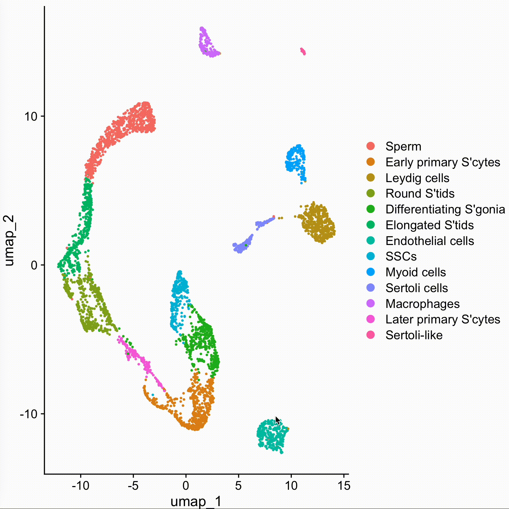

In the previous vignette, we performed cell clustering using unsupervised methods. Typically, a PCA or integrated space (e.g., Harmony) is generated during this process, and we then calculate the cell weight matrix directly from the cell embedding space. This approach is convenient for running the pipeline, and provide the general result in all cell population. Furthermore, for specific signaling or biological pathways, it is often more informative to focus on a 'supervised' cell ordering. This vignette demonstrates how to perform spatial dissimilarity test in low-dimensional spaces, such as cell trajectory.


# Prepare raw data 

We used the human testis single-cell atlas dataset for this analysis. The full dataset is publicly available at [GSE112013](https://www.ncbi.nlm.nih.gov/geo/query/acc.cgi?acc=GSE112013). For this vignette, we only used replicate 1.

```bash
## We first download the BAM files and GTF file
wget -c https://sra-pub-src-1.s3.amazonaws.com/SRR6860519/14515X1.bam.1 -O donor1_rep1.bam
wget -c https://sra-pub-src-1.s3.amazonaws.com/SRR6860520/14606X1.bam.1 -O donor1_rep2.bam

## Please Note: we use a different annotation file from previos vignette, because the BAM file use NCBI style chromosome name here.
wget https://ftp.ensembl.org/pub/release-114/gtf/homo_sapiens/Homo_sapiens.GRCh38.114.chr.gtf.gz

## Index the bam files for track plots
samtools index donor1_rep1.bam
samtools index donor1_rep2.bam

## Then we use PISA to generate feature counts
PISA anno -gtf Homo_sapiens.GRCh38.114.chr.gtf.gz -exon -psi -o d1_rep2_anno.bam donor1_rep2.bam
PISA anno -gtf Homo_sapiens.GRCh38.114.chr.gtf.gz -exon -psi -o d1_rep1_anno.bam donor1_rep1.bam

mkdir exp1
mkdir exp2
mkdir exon1
mkdir exon2
mkdir junction1
mkdir junction2
mkdir exclude1
mkdir exclude2

PISA count -tag CB -umi UB -anno-tag GN -outdir exp1 d1_rep1_anno.bam
PISA count -tag CB -umi UB -anno-tag GN -outdir exp2 d1_rep2_anno.bam
PISA count -tag CB -umi UB -anno-tag EX -outdir exon1 d1_rep1_anno.bam
PISA count -tag CB -umi UB -anno-tag EX -outdir exon2 d1_rep2_anno.bam
PISA count -tag CB -umi UB -anno-tag JC -outdir junction1 d1_rep1_anno.bam
PISA count -tag CB -umi UB -anno-tag JC -outdir junction2 d1_rep2_anno.bam

# Note: Although we generate the excluded reads here, we do not use them in this demonstration for the sake of simplicity. However, it is recommended to test them in real cases, so I’ve kept the data available for you to use in your own analyses.
PISA count -tag CB -umi UB -anno-tag ER -outdir exclude1 d1_rep1_anno.bam
PISA count -tag CB -umi UB -anno-tag ER -outdir exclude2 d1_rep2_anno.bam

```
```{r, setup, include=FALSE}
knitr::opts_knit$set(root.dir = './humantestis/')
```

# Cell clustering and annotation

```{r message=FALSE}
require(Yano)

exp1 <- ReadPISA("exp1/", prefix = "d1-rep1-")
exp2 <- ReadPISA("exp2/", prefix = "d1-rep2-")

exp <- mergeMatrix(exp1, exp2)

obj <- QuickRecipe(exp, min.features = 800, min.cells = 100, resolution=0.2)
rm(exp1, exp2, exp)

obj$replicate <- gsub("d1-(.*)-.*-1", "\\1", colnames(obj))
DimPlot(obj, label = TRUE, label.size = 5)

FeaturePlot(obj, features = c("CD14", "VIM", "VWF", "ACTA2", "DLK1", "DAZL", "MAGEA4", "UTF1", "ID4", "FGFR3", "KIT", "DMRT1", "DMRTB1", "STRA8", "SYCP3", "SPO11", "MLH3", "ZPBP", "TNP1", "PRM2"), ncol=5, order=TRUE) & NoAxes() & NoLegend()

new.cluster.ids <- c("Sperm", "Early primary S'cytes", "Leydig cells", "Round S'tids", "Differentiating S'gonia", "Elongated S'tids", "Endothelial cells", "SSCs", "Myoid cells", "Sertoli cells", "Macrophages", "Later primary S'cytes", "Sertoli-like")
names(new.cluster.ids) <- levels(obj)
obj <- RenameIdents(obj, new.cluster.ids)
DimPlot(obj, reduction = "umap", label = TRUE, pt.size = 0.5) + NoLegend()
```

# Cell development trajetory construction

We now select germline cells from the dataset and construct the cell development trajectory using a principal curve. Although there are many well-documented methods for constructing linear trajectories, here we use a straightforward and perhaps the simplest approach purely for demonstration purposes.
```r
sel <- DimSelector(obj)
obj.sel <- obj[,sel]
```
{width=50%}

```{r include=FALSE}
obj.sel <- readRDS("./select.rds")
```
```{r}
require(princurve)
emb <- Embeddings(obj.sel, 'umap')
emb0 <- as.data.frame(emb)
emb0$idents <- Idents(obj)[rownames(emb0)]
emb0 %>% group_by(idents) %>% summarize(x=median(umap_1),y=median(umap_2)) -> emb1
emb2 <- as.matrix(emb1[,c("x","y")])
rownames(emb2) <- emb1$idents
emb2 <- emb2[c("SSCs", "Differentiating S'gonia", "Early primary S'cytes", "Later primary S'cytes", "Round S'tids", "Elongated S'tids", "Sperm"),]
pc <- princurve::principal_curve(x = emb, start = emb2)
s <- as.data.frame(pc$s)
colnames(s) <- c("x", "y")
emb0 <- cbind(emb0, s)
emb0 <- emb0[pc$ord, ]

ggplot(emb0)+ geom_point(aes(umap_1, umap_2, color = idents)) + geom_path(aes(x,y), color = "blue", linewidth=1)+ geom_point(data = emb2, aes(x, y), size=2) 
```

# Perform alternative splicing analysis along the cell trajetory
```{r message=FALSE}
cells <- colnames(obj.sel)

exon1 <- ReadPISA("exon1/", prefix = "d1-rep1-", cells = cells)
exon2 <- ReadPISA("exon2/", prefix = "d1-rep2-", cells = cells)
exon <- mergeMatrix(exon1, exon2)

junction1 <- ReadPISA("junction1/", prefix = "d1-rep1-", cells = cells)
junction2 <- ReadPISA("junction2/", prefix = "d1-rep2-", cells = cells)
junction <- mergeMatrix(junction1, junction2)

obj.sel[['exon']] <- CreateAssayObject(exon, min.cells = 100)
obj.sel[['junction']] <- CreateAssayObject(junction, min.cells = 100)
rm(exon, exon1,exon2, junction, junction1, junction2)

order.cells <- rownames(emb0)

DefaultAssay(obj.sel) <- "exon"
obj.sel <- NormalizeData(obj.sel)
obj.sel <- ParseExonName(obj.sel)
```
When setup order cells, the weight matrix name will be named to "trajectory_wm".

```{r fig.width=12, fig.height=5}
obj.sel <- RunAutoCorr(obj.sel, order.cells = order.cells, wm.name = "trajectory_wm")
obj.sel <- RunSDT(obj.sel, wm.name = "trajectory_wm", bind.name = "gene_name", bind.assay = "RNA")

DefaultAssay(obj.sel) <- "junction"
obj.sel <- NormalizeData(obj.sel)
obj.sel <- ParseExonName(obj.sel)
obj.sel <- RunAutoCorr(obj.sel, order.cells = order.cells, wm.name = "trajectory_wm")
obj.sel <- RunSDT(obj.sel, wm.name = "trajectory_wm", bind.name = "gene_name", bind.assay = "RNA")

FbtPlot(obj.sel, val = "gene_name.padj", assay = c("exon", "junction"), shape.by = "assay", color.by = "assay")

Meta(obj.sel, assay = "exon") %>% filter(gene_name.padj <1e-8) %>% knitr::kable()
Meta(obj.sel, assay = "junction") %>% filter(gene_name.padj <1e-8) %>% knitr::kable()

FeaturePlot(obj.sel, features = c("3:52413996-52414048/+/PHF7", "3:52414048-52414496/+/PHF7", "PHF7"), ncol=3, order=TRUE)
```

# Perform alternative splicing analysis for all cell space

To use all cell space, we do not need to specify a name for the weight matrix here, because it will default to using the PCA reduction map to generate the weight matrix. The resulting matrix will be named "*reduction*_wm".

```{r}
DefaultAssay(obj.sel) <- "exon"
obj.sel <- RunAutoCorr(obj.sel)
```

Now we have two weight matrices. If no name is specified in RunSDT(), the first matrix will always be used by default, so we need to explicitly specify "pca_wm" to avoid misusing the weight matrix here.

```{r}
grep("_wm", names(obj.sel), value=TRUE)
obj.sel <- RunSDT(obj.sel, bind.name = "gene_name", bind.assay = "RNA", wm.name = "pca_wm", prefix="all")
DefaultAssay(obj.sel) <- "junction"
obj.sel <- RunAutoCorr(obj.sel)
obj.sel <- RunSDT(obj.sel, bind.name = "gene_name", bind.assay = "RNA", wm.name = "pca_wm", prefix="all")
```

***By comparing the use of cell trajectory ordering with the PCA space, we found that using the PCA approach can detect more alternatively expressed genes. This is because forcing all cells into a 1D trajectory ordering preserves only the rank of each cell, but loses much of the neighborhood information about cells in the broader context. Since cell trajectories are typically constructed based on cell–cell distances in high-dimensional space, regardless of the algorithm used to build the trajectory, I personally recommend using the cell space directly rather than relying solely on 1D cell ordering, unless you have specific reasons or detailed knowledge.***

```{r fig.width=12, fig.height=5}
FbtPlot(obj.sel, val = "all.padj", assay = c("exon", "junction"), shape.by = "assay", color.by = "assay")

Meta(obj.sel, assay = "exon") %>% filter(all.padj <1e-20) %>% knitr::kable()
Meta(obj.sel, assay = "junction") %>% filter(all.padj <1e-20) %>% knitr::kable()
```
# Perform alternative splicing on a supervised two dimension space

We can also perform the analysis using a supervised two-dimensional cell space. As an example, we utilize Seurat’s built-in cell cycle scoring scheme for demonstration purposes.

```{r fig.width=12, fig.height=5}
DefaultAssay(obj.sel) <- "RNA"

s.genes <- cc.genes$s.genes
g2m.genes <- cc.genes$g2m.genes

obj.sel[['Group']] <- Idents(obj.sel)
obj.sel <- CellCycleScoring(obj.sel, s.features = s.genes, g2m.features = g2m.genes, set.ident = TRUE)

df <- obj.sel[[]]

p1 <- ggplot(df) + geom_point(aes(x=S.Score, y = G2M.Score, color = Phase))
p2 <- ggplot(df) + geom_point(aes(x=S.Score, y = G2M.Score, color = Group))
p1 + p2

# Create cell cycle coordinate space with the module scores
ccc <- as.matrix(df[, c("S.Score", "G2M.Score")])
head(ccc)
colnames(ccc) <- c("CCC_1", "CCC_2")

obj.sel[['ccc']] <- CreateDimReducObject(embeddings = ccc, assay = "RNA")

DefaultAssay(obj.sel) <- "exon"
obj.sel <- RunAutoCorr(obj.sel, reduction = "ccc", wm.name = "ccc_wm", dims=1:2)
obj.sel <- RunSDT(obj.sel, wm.name = "ccc_wm", bind.name = "gene_name", bind.assay = "RNA", prefix = "ccc")

DefaultAssay(obj.sel) <- "junction"
obj.sel <- RunAutoCorr(obj.sel, reduction = "ccc", wm.name = "ccc_wm", dims=1:2)
obj.sel <- RunSDT(obj.sel, wm.name = "ccc_wm", bind.name = "gene_name", bind.assay = "RNA", prefix = "ccc")
FbtPlot(obj.sel, val = "ccc.padj", assay = c("exon", "junction"), shape.by = "assay", color.by = "assay")

Meta(obj.sel, assay = "exon") %>% filter(ccc.padj<1e-30) %>% knitr::kable()

FeaturePlot(obj.sel, reduction =  "ccc", features = c("7:74196642-74197050/+/EIF4H", "EIF4H"), order = TRUE)
```

```{r message=FALSE, fig.width=15, fig.height=10}
gtf <- gtf2db("./Homo_sapiens.GRCh38.114.chr.gtf.gz")
bamfiles <- list(rep1 = "./donor1_rep1.bam", rep2 = "./donor1_rep2.bam")
cell.list <- split(obj.sel$Phase, obj.sel$replicate)

cell.list1 <- lapply(cell.list, function(x) {
  nm <- names(x)
  names(x) <- gsub(".*rep[12]-(.*)","\\1",nm)
  x
})
str(cell.list1)

TrackPlot(bamfile = bamfiles, cell.group = cell.list1, gtf = gtf, gene = "EIF4H", highlights = c(74196642,74197050), junc=TRUE)

```

```{r}
Command(obj.sel)

sessionInfo()
```
