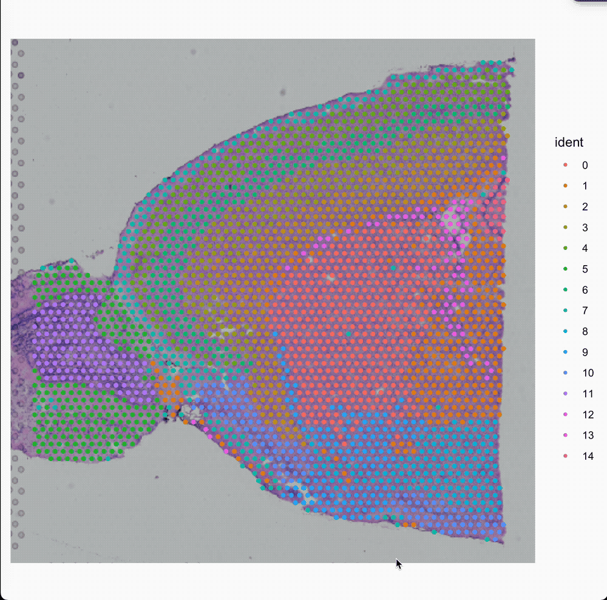
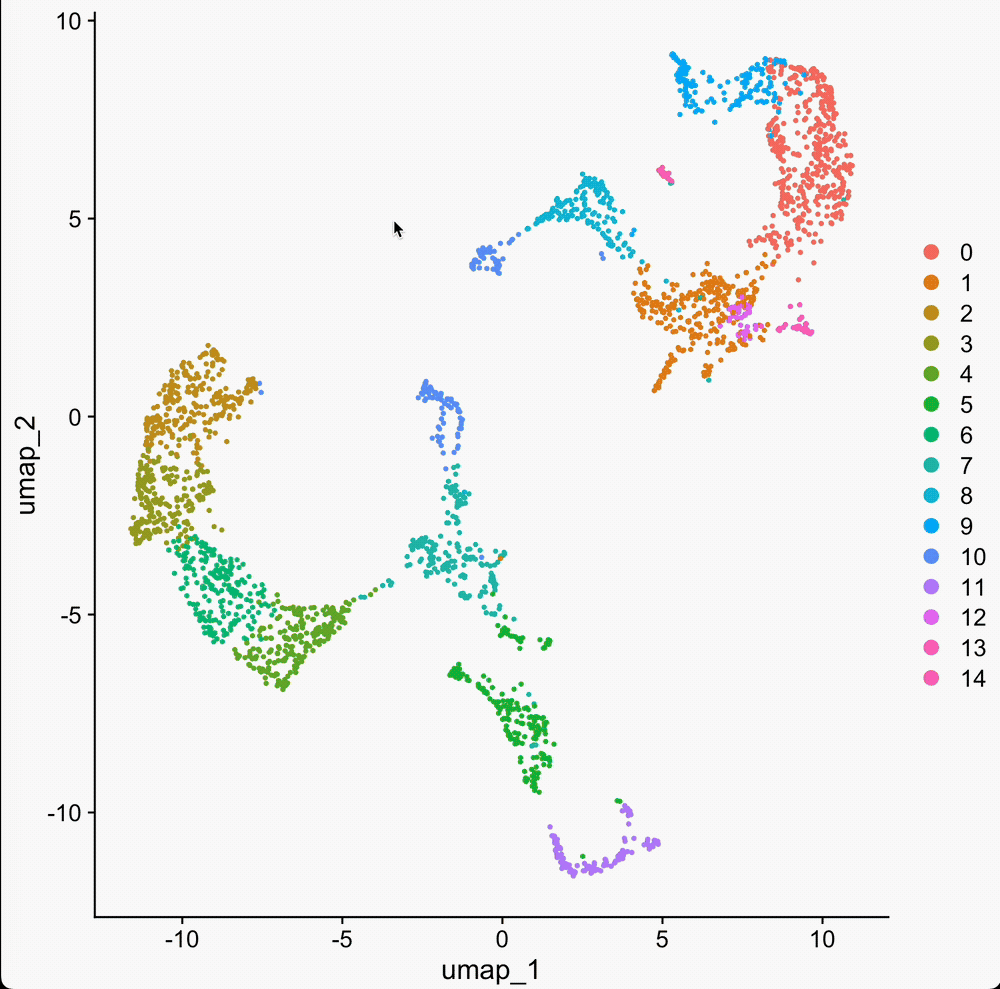
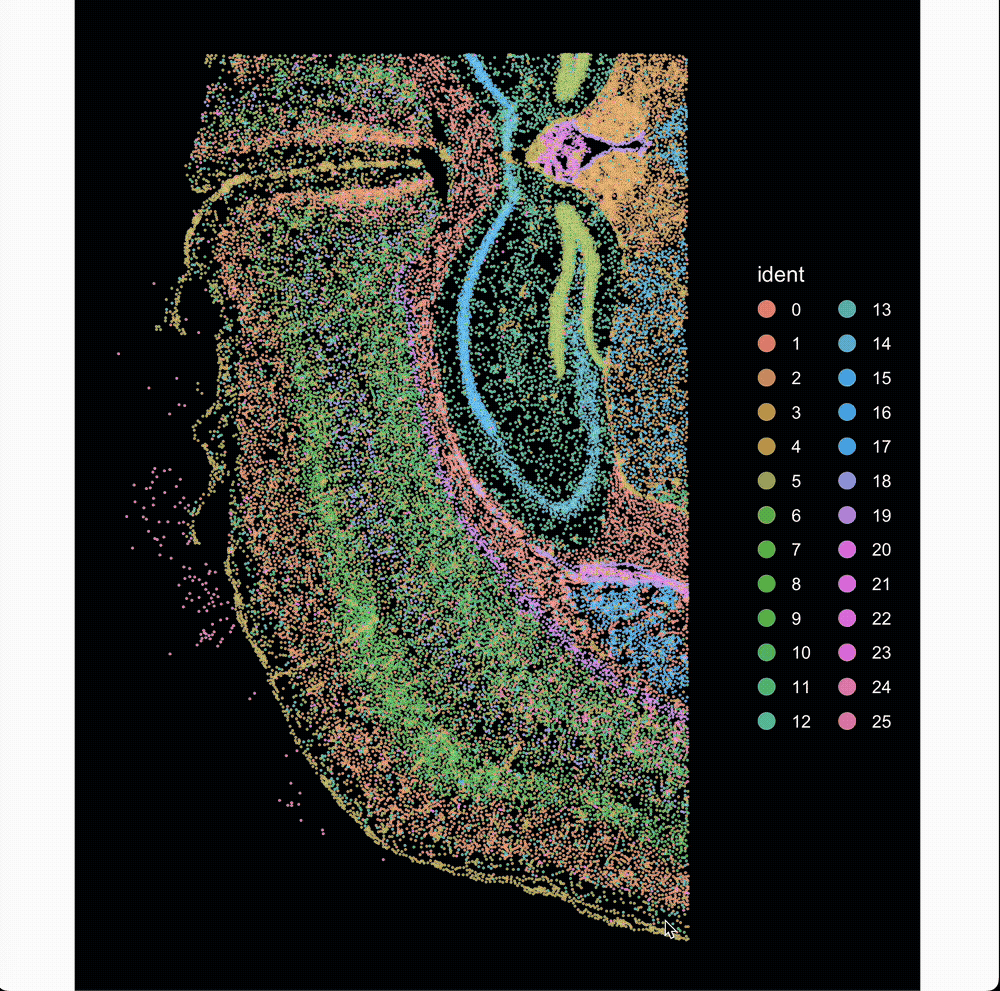
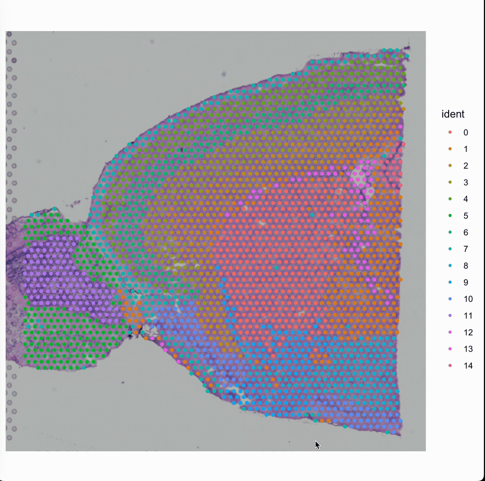

This vignette demonstrates how to use Yano buildin functions to interactively select or pick cells/spots from a plot using your mouse and keyboard. While tools like CellxGene are widely used for this purpose, to the best of our knowledge, an efficient solution for performing this task within the R environment is still lacking. Here, we introduce a lightweight, fast and native implementation of a cell selector to address this gap.

## Prepare the data.
We use demo data from SeuratData for simplity.

```{r message=FALSE, warning=FALSE}
require(Yano)
require(SeuratData)

InstallData("stxBrain")

brain <- LoadData("stxBrain", type = "anterior1")
brain <- SCTransform(brain, assay = "Spatial", verbose = FALSE)
brain <- RunPCA(brain, assay = "SCT", verbose = FALSE)
brain <- FindNeighbors(brain, reduction = "pca", dims = 1:30)
brain <- FindClusters(brain, verbose = FALSE)
brain <- RunUMAP(brain, reduction = "pca", dims = 1:30)

SpatialPlot(brain)
```

## Select spots from spatial plot
```r
sel.1 <- SpatialSelector(brain)
```
***Press `ESC` on your keyboard to exist the selection!***

{width=50%}


Now the selected cells will be exported to `sel.1`. If you want return a object, try to set `return.object=TRUE` in the function.


## Select cells from dimension reduction plot

We can also select cells from dimension reduction plot.
```{r}
DimPlot(brain)
```

```r
sel.1 <- DimSelector(brain)
```

***Press `ESC` on your keyboard to exist the selection!***

{width=50%}

## Select cells based on a feature expression
```{r}
FeaturePlot(brain, features = c('Ttr'), order=TRUE)
```

```r
FeatureSelector(brain, feature = c('Ttr'), order=TRUE)
```

Please note in `FeatureSelector()` only one feature is support at each selection. Therefore, I designed the parameter `feature` instead of orignal `features` here.

{width=50%}


## Select cells from Image-based spatial data

Here we will use 10x Genomics Xenium data, generated from [Seurat's tutorial](https://satijalab.org/seurat/articles/seurat5_spatial_vignette_2).
```{r warnings=FALSE}
xenium.obj <- readRDS("xenium.rds")
ImageDimPlot(xenium.obj, border.color = "white", border.size = 0.1, cols = "polychrome")
```

```r
ImageDimSelector(xenium.obj, border.color = "white", border.size = 0.1)
```
{width=80%}


## Generate 2D concave hull of selected region

In spatial transcriptomics, it is sometimes necessary to manually define capsule or membrane regions, as these areas are often thin, mixed with neighboring cells, and difficult to identify accurately. Manually specifying these regions can be beneficial for downstream analyses, where precise spatial organization of cells is critical for understanding tissue architecture and functional gradients.

```r
sel <- SpatialConcaveHull(brain)
```

{width=50%}


## Questions?

If you have any questions regarding this vignette, the usage of Yano or suggestions, please feel free to report them through the [discussion forum](https://github.com/shiquan/Yano/discussions).


```{r}
sessionInfo()
```
